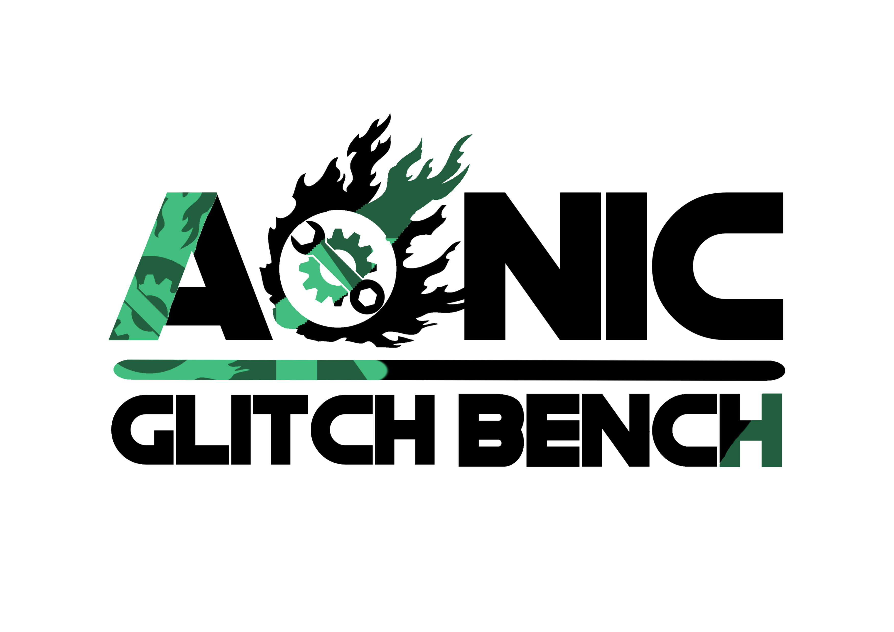

# Aonic Glitch Bench

  

AI-assisted game performance benchmarking and optimization for PC games across diverse hardware configurations.

This repository currently serves as the documentation home for the final year project **Aonic Glitch Bench: Game Performance and Optimization Tool**, completed at the **National University of Computer and Emerging Sciences, Lahore**. The README is based on the final project report dated **May 8, 2025**.

The full report is available here: [F24-207_FINAL.pdf](./docs/F24-207_FINAL.pdf)

## Overview

Modern PC games are difficult to optimize because players run them on widely different CPUs, GPUs, RAM capacities, storage devices, drivers, and operating systems. Aonic Glitch Bench was proposed to reduce that complexity for both gamers and developers by combining:

- Real-time hardware monitoring
- Automated benchmarking
- Configuration generation
- Performance scoring
- AI-driven optimization ideas
- Cross-engine compatibility goals

The core idea is simple: observe how a game behaves on a machine, evaluate the system bottlenecks, test better configurations, and recommend or apply settings that improve performance without unnecessarily sacrificing visual quality.

## Problem Statement

The project addresses a common issue in PC gaming and game development: the same game can behave very differently across hardware setups. This creates two major problems:

- Gamers often struggle with low FPS, stutter, overheating, and poor default graphics settings.
- Developers and QA teams must manually test and tune performance across a huge range of hardware combinations.

Aonic Glitch Bench aims to bridge that gap through a unified tool for benchmarking, optimization, and analysis.

## Objectives

### For Gamers

- Automatically benchmark the system and recommend better in-game settings
- Balance visual fidelity with stable performance
- Reduce the need for manual trial-and-error tuning

### For Developers

- Identify bottlenecks early in the development cycle
- Generate optimized configuration profiles for target hardware
- Support testing and debugging workflows with performance data

### Shared Goal

- Provide a single workflow that serves both end users and development teams

## What The Project Includes

According to the report, the project vision includes:

- Real-time monitoring of CPU, GPU, and RAM
- Historical logging of performance data
- AI-assisted optimization recommendations
- Stress testing and benchmarking
- Game-specific optimization profiles
- Configuration generation for supported game engines
- Cross-platform support goals for Windows and Linux
- Planned integration with community-shared optimized profiles

## Prototype Modules Implemented In The Report

The implementation chapter describes an initial prototype centered on the following modules:

### 1. Configuration Manager

- Generates and manages hardware-aware game configuration profiles
- Applies settings such as resolution, texture quality, and frame rate limits
- Supports automated optimization with room for manual preference tuning

### 2. Logger

- Collects real-time sensory data from hardware components
- Uses `LibreHardwareMonitor` for CPU, GPU, temperature, and RAM metrics
- Operates at a polling interval of 1000 ms over a 40-second scan window

### 3. Desktop Interface

- Provides the main user-facing workflow
- Lets users select supported games and optimization preferences
- Detects game folders and prompts manual selection when needed

### 4. Debug Console

- Exposes logs, warnings, errors, and runtime decisions
- Helps developers inspect optimization behavior and troubleshoot issues

### 5. Game Manager

- Coordinates the overall optimization flow
- Connects the Configuration Manager, Logger, and Desktop Interface
- Oversees testing of candidate configurations and selection of the best one

### 6. Benchmark Scoring Mechanism

The report also defines a scoring model based on:

- FPS and 1% low FPS
- Frame time
- CPU and GPU utilization
- Temperature
- VRAM usage
- Power consumption
- Input latency

The final score is normalized to a 0-100 scale and categorized into tiers such as excellent, good, average, and poor.

## Proposed AI And Automation Workflow

The broader project vision goes beyond the initial prototype and proposes:

- Reinforcement Learning for dynamic configuration tuning
- A hybrid optimization strategy combining RL with Genetic Algorithms
- Automated gameplay and scenario execution through `GameDriver.io`
- Cloud-based training and large-scale processing using AWS

The report outlines a future workflow where the system:

1. Detects or registers a game
2. Loads existing performance archives or fetches metadata
3. Logs system behavior during gameplay
4. Generates candidate configuration combinations
5. Tests and refines those combinations
6. Applies the best-performing setup for the user's hardware

## Architecture

The design chapter presents a layered architecture, complemented by client-server and microservices ideas.

### Layered Architecture

- **User Interface Layer**: performance monitoring, controls, and debugging views
- **Core Layer**: game management, optimization coordination, and request handling
- **Utility/Tools Layer**: evaluators, generators, and automation support
- **Data/Configuration Layer**: logs, save states, configuration storage, and archives
- **System Components Layer**: low-level hardware metric collection

### Architectural Characteristics

- Separation of concerns through layers
- Modular services for easier updates and fault isolation
- Client-server split between user interaction and heavier processing
- Designed for long-term scalability and adaptability

## Performance Assessment Focus

The experimental discussion emphasizes that optimization is not only about FPS. The report evaluates:

- CPU load, core utilization, frequency, and temperature
- GPU load, memory use, clock speed, and temperature
- RAM usage and paging activity
- Storage throughput and I/O wait
- Network latency, packet loss, and bandwidth use
- System-wide temperature and power constraints
- Background OS activity and resource allocation

It also highlights high-cost graphical settings such as:

- Resolution
- Anti-aliasing
- Dynamic lighting
- Shadow mapping
- Global illumination
- Ray tracing
- Post-processing effects

## Target Engines And Tooling

The report references the following ecosystem around Aonic Glitch Bench:

- **Game engines**: Unity, Unreal Engine, Godot
- **Monitoring**: LibreHardwareMonitor
- **Automation**: GameDriver.io
- **Cloud/ML direction**: AWS cloud services and reinforcement learning workflows
- **Metadata sources**: SteamDB and related game provider APIs

Some implementation technologies in the report are explicitly marked as tentative, including:

- Python or R for performance analysis
- Flutter, C#, or JavaFX for the desktop frontend

## User-Facing Requirements

The user manual section lists the following baseline requirements:

- **OS**: Windows 10/11 or Ubuntu 20.04+
- **CPU**: Quad-core Intel i5 / AMD Ryzen 5 or better
- **RAM**: 4 GB minimum, 16 GB recommended
- **GPU**: Dedicated NVIDIA or AMD graphics card
- **Storage**: 3 GB available space, SSD recommended

Key user-facing capabilities described in the report include:

- Game optimization from a dashboard flow
- Real-time hardware metrics
- Benchmark runs under peak load
- Account-based access and community profile ideas

## Project Status

This repository reflects the **final year project documentation and prototype design/implementation report**. Based on the report:

- Core prototype modules were designed and documented
- Benchmarking and optimization logic were specified
- Reinforcement learning and cloud-backed automation remain part of the planned roadmap

So the project is best understood as a documented prototype plus a forward-looking technical design, rather than a fully productized public release.

## Future Work

The report identifies several next steps:

- Integrate advanced machine learning models
- Expand support for more game engines and titles
- Improve intelligent game detection
- Extend community and cloud-backed optimization workflows
- Refine optimization strategies through continuous feedback and testing

## Team

- **Muhammad Anas Asim** - 21L-5789 BS(SE)
- **Muhammad Ahmad Adnan** - 21L-5759 BS(SE)
- **Muhammad Faaiz Ali** - 21L-5791 BS(SE)
- **Supervisor:** Dr. Kashif Zafar

## Citation

If you reference this work, please cite the project report:

> *Aonic Glitch Bench: Game Performance and Optimization Tool*, Final Year Project, National University of Computer and Emerging Sciences, Lahore, May 8, 2025.
